# Setting Up a New Mac

This guide explains how to prepare a new Mac laptop for Python development. Wherever possible, it also points out equivalent Linux shell commands.

## Contents
- [CLI Tools](#cli-tools)
  - [Brew](#brew)
  - [Oh My Zsh](#oh-my-zsh)
    - [Plugins](#plugins)
    - [Powerlevel10k](#powerlevel10k)
  - [Other CLI Tools](#other-cli-tools)
  - [Bash Aliases](#bash-aliases)
- [Editors](#editors)
  - [Installing GNU Nano](#installing-gnu-nano)
  - [Vim Colors](#vim-colors)
  - [Kate](#kate)
- [Docker, Kubernetes, and Other Vegetables](#docker-kubernetes-and-other-vegetables)
  - [lazydocker](#lazydocker)
  - [K8s CLI Tools](#k8s-cli-tools)
  - [K9s](#k9s)
  - [Docker Desktop](#docker-desktop)
  - [OpenLens](#openlens)
  - [Useful Commands](#useful-commands)
- [Tile Window Shortcuts](#tile-window-shortcuts)
- [Maccy](#maccy)
- [Fonts](#fonts)
  - [Hack Nerd Font](#hack-nerd-font)
  - [Meslo Font](#meslo-font)
- [iTerm2](#iterm2)
- [Chrome Extensions](#chrome-extensions)
- [Applications](#applications)
  - [AI Tools](#ai-tools)

-------------------------------------------------------------------------------

## CLI Tools

### Brew

URL: <https://brew.sh/>

Paste this command into a macOS Terminal or Linux shell prompt:

```bash
/bin/bash -c "$(curl -fsSL https://raw.githubusercontent.com/Homebrew/install/HEAD/install.sh)"
```

### Oh My Zsh

URL: <https://ohmyz.sh/#install>

Paste this command into a macOS Terminal or Linux shell prompt:

```bash
sh -c "$(curl -fsSL https://raw.githubusercontent.com/ohmyzsh/ohmyzsh/master/tools/install.sh)"
```

#### Plugins

Reference: [Oh My Zsh with autosuggestions, syntax highlighting, fast syntax highlighting, and autocomplete](https://gist.github.com/n1snt/454b879b8f0b7995740ae04c5fb5b7df)

Install the plugins with Homebrew:

macOS ![Mac OS X][macosx]

```bash
# Install tools
brew install zsh-autosuggestions zsh-syntax-highlighting
```

Ubuntu/Debian ![Linux][linux]

```bash
sudo apt install zsh-autosuggestions zsh-syntax-highlighting
```

Install the plugins in Zsh:

```bash
# Install plugins
## zsh-autosuggestions plugin
git clone --depth 1 https://github.com/zsh-users/zsh-autosuggestions.git $ZSH_CUSTOM/plugins/zsh-autosuggestions

## zsh-syntax-highlighting plugin
git clone --depth 1 https://github.com/zsh-users/zsh-syntax-highlighting.git $ZSH_CUSTOM/plugins/zsh-syntax-highlighting

## zsh-fast-syntax-highlighting plugin
git clone --depth 1 https://github.com/zdharma-continuum/fast-syntax-highlighting.git $ZSH_CUSTOM/plugins/fast-syntax-highlighting

## zsh-autocomplete plugin
git clone --depth 1 https://github.com/marlonrichert/zsh-autocomplete.git $ZSH_CUSTOM/plugins/zsh-autocomplete
```

Enable the plugins by editing `.zshrc`:

```bash
vi ~/.zshrc
```

Locate the line that reads `plugins=(git)` and replace it with:

```bash
# This line is used for Zsh plugins only
plugins=(git zsh-autosuggestions zsh-syntax-highlighting fast-syntax-highlighting zsh-autocomplete)

# Use this line for Python, Docker, Kubernetes, npm, and Zsh plugins
plugins=(git brew colored-man-pages colorize python pip pyenv docker kubectl helm azure npm nvm vault zsh-interactive-cd zsh-autosuggestions zsh-syntax-highlighting zsh-autocomplete)
```

Reload `.zshrc`:

```bash
source ~/.zshrc
```

#### Powerlevel10k

URL: <https://github.com/romkatv/powerlevel10k?tab=readme-ov-file#oh-my-zsh>

Clone the repository:

```bash
git clone --depth=1 https://github.com/romkatv/powerlevel10k.git $ZSH_CUSTOM/themes/powerlevel10k

# Enable the theme by editing .zshrc
vi ~/.zshrc
```

Locate the line that starts with `ZSH_THEME=` and replace it with:

```bash
ZSH_THEME="powerlevel10k/powerlevel10k"
```

Re-run the configuration wizard:

```bash
p10k configure
```

### Other CLI Tools

| Tool | Description |
|-|-|
| `mc` | Midnight Commander file manager |
| `vifm` | Vi-style file manager |
| `tmux` | Terminal multiplexer |
| `ranger` | Visual file manager |
| `highlight` | Source code to formatted text converter (helpful for ranger) |
| `multitail` | View several log files at once |
| `colortail` | Log colorizer that makes log checks easier |
| `ccze` | Fast log colorizer written in C |
| `htop` | Interactive process viewer |
| `nmon` | Benchmark and monitor tool |
| `bat` | `cat` replacement with syntax highlighting |
| `fzf` | Command-line fuzzy finder |
| `ripgrep` | Recursive search tool (`rg`) |
| `tldr` | Simplified community-driven man pages |
| `exa` | Modern replacement for `ls` (Linux only) ![Linux][linux] |
| `lsd` | Next-generation `ls` command (macOS) ![Mac OS X][macosx] |
| `ncdu` | NCurses disk usage explorer |
| `duf` | Disk usage/free utility |
| `neofetch` | System information display |
| `tig` | Text-mode interface for Git |

- Best ncurses Linux console programs: <https://www.etcwiki.org/wiki/Best_ncurses_linux_console_programs>
- Command line tools: <https://hackingcpp.com/dev/command_line_tools.html>

Install the packages:

macOS ![Mac OS X][macosx]

```bash
brew install mc vifm tmux ranger highlight
brew install multitail colortail ccze htop
brew install bat fzf ripgrep tldr lsd
brew install ncdu duf neofetch tig
```

Ubuntu/Debian ![Linux][linux]

```bash
sudo apt install mc vifm tmux ranger highlight
sudo apt install multitail colortail ccze htop
sudo apt install bat fzf ripgrep tldr lsd
sudo apt install ncdu duf neofetch tig
```

### Bash Aliases

Create a Bash alias file with the following command:

```bash
touch ~/.bash_aliases
echo -e \
"export HISTCONTROL=ignoreboth:erasedups\n"\
"alias h='history'\n"\
"alias which='type -a'\n"\
"alias ..='cd ..'\n"\
"alias ls='/bin/ls -h --color=auto'\n"\
"alias ll='ls -lv --group-directories-first'\n"\
"alias lt='ls -ltr'         #  Sort by date, most recent last\n"\
"alias lm='ll | more'       #  Pipe through more\n"\
"alias lr='ll -R'           #  Recursive ls\n"\
"alias la='ll -a'           #  Show hidden files\n"\
"alias grep='/bin/grep --color=auto'\n"\
"alias diff='/usr/bin/diff --color=auto'\n"\
"alias bat=batcat\n"\
"alias dex='_dexec(){ docker exec -it \"\$@\" bash; unset -f _dexec;}; _dexec'\n"\
"alias dps='docker ps --format \"table {{.Names}}\t{{.ID}}\t{{.Image}}\t{{.Ports}}\" | sort'\n"\
"alias lzw='~/.local/bin/lazydocker'   # in case you installed it\n"\
"bind '\"\\\\e[6~\": history-search-forward'\n"\
"bind '\"\\\\e[5~\": history-search-backward'\n"\
"# enable colored prompt for git branches using parse_git_branch\n"\
"function parse_git_branch() { git branch 2> /dev/null | sed -e '/^[^*]/d' -e 's/* \(.*\)/(\1)/'; }\n"\
"export PS1=\$(parse_git_branch)\$PS1\n"\
> ~/.bash_aliases
```

-------------------------------------------------------------------------------

## Editors

### Installing GNU Nano

URL: <https://gist.github.com/GLMeece/94b8dcc20b9785d5b783ba5498b52fdf#installing-gnu-nano>

macOS ![Mac OS X][macosx]

```bash
brew install nano
```

Ubuntu/Debian ![Linux][linux]

```bash
sudo apt install nano
```

Enable syntax highlighting:

```bash
nano ~/.nanorc
```

Add this line:

```bash
include "/opt/homebrew/Cellar/nano/*/share/nano/*.nanorc"
```

Press __`⌃-o`__ (control-o) and then __`⏎`__ (enter/return) to save the file. Press __`⌃-x`__ (control-x) to exit.

### Vim Colors

URL: <https://www.cyberciti.biz/faq/turn-on-or-off-color-syntax-highlighting-in-vi-or-vim/>

Enable Vim syntax colors permanently by editing `~/.vimrc`:

```bash
vi ~/.vimrc
```

Append the following options:

```bash
" Indentation
set tabstop=4      " Number of spaces that a <Tab> counts for
set shiftwidth=4   " Number of spaces for each step of (auto)indent
set expandtab      " Use spaces instead of tabs

" Search
set ignorecase     " Ignore case while searching
set smartcase      " Override ignorecase if search contains capital letters
set incsearch      " Show matches as you type
set hlsearch       " Highlight search results

" Syntax highlighting - works on Vim only
syntax   on
filetype on

" Toggle paste mode with F2
" Auto-indentation, line wrapping, syntax highlighting adjustments, mapping of certain keys
set pastetoggle=<F2>
```

Save and close the file.

### Kate

To install Kate on macOS:

1. Download the installer from <https://kate-editor.org/get-it/>.
2. Open the `.dmg` file and either double-click the `kate` icon or drag it into the Applications folder.
3. If you see a security warning stating that "Kate" cannot be opened because Apple cannot check it for malicious software:
   - Go to **System Preferences** > **Security & Privacy** > **General**.
   - Look for the note that says "Kate was blocked from use."
   - Click **Open Anyway** and confirm.
4. Launch Kate from the Applications folder.

For a more stable release, consider alternative installation methods:
- Install Kate with MacPorts: `sudo port install kate` (requires MacPorts). URL: <https://ports.macports.org/port/kate/>

-------------------------------------------------------------------------------

## Docker, Kubernetes, and Other Vegetables

### lazydocker

Install `lazydocker`: <https://github.com/jesseduffield/lazydocker#installation> (MIT License). Homebrew core includes the formula, but tapping the upstream formula provides more frequent updates. It also works on Linux.

```bash
brew install jesseduffield/lazydocker/lazydocker
```

### K8s CLI Tools

`kubectl` is the Kubernetes command-line tool for communicating with a cluster's control plane via the Kubernetes API.

```bash
brew install kubectl
```

`kubectx` switches between Kubernetes contexts quickly, and `kubens` swaps namespaces just as easily.

```bash
brew install kubectx
```

URL: <https://github.com/ahmetb/kubectx>

### K9s

K9s is a terminal-based UI for Kubernetes clusters. It continuously watches for changes and offers commands to interact with observed resources.

```bash
brew install derailed/k9s/k9s
```

URL: <https://k9scli.io/topics/install/>

### Docker Desktop

URL: <https://docs.docker.com/desktop/install/mac-install/>

Enable Kubernetes in Settings.

<div align="center">
 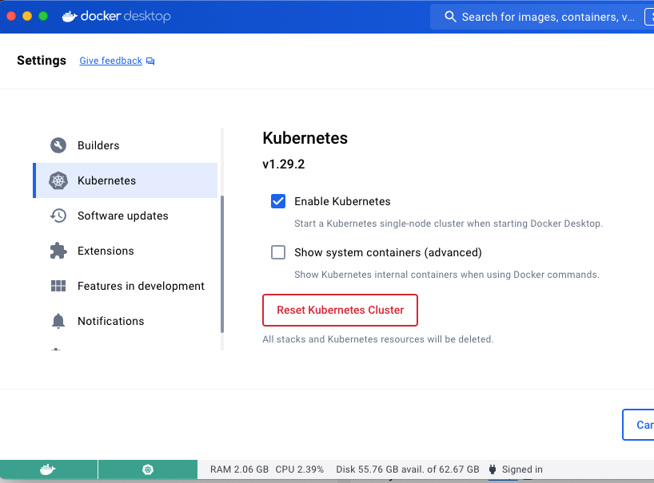
</div>

Add your user to the `docker` group (Linux):

URL: <https://docs.docker.com/engine/install/linux-postinstall/>

```bash
sudo usermod -aG docker $USER
```

If that does not work, run:

```bash
# sudo groupadd docker   # add the group if it does not exist

sudo usermod -aG docker $USER
newgrp docker
docker run hello-world   # test in user mode
```

### OpenLens

Open-source Kubernetes management tool (Lens IDE alternative).  
URL: <https://github.com/MuhammedKalkan/OpenLens/releases>

Install these extensions via the Extensions menu:

- `@alebcay/openlens-node-pod-menu`
- `lens-extension-network-policy-viewer`
- `@nevalla/kube-resource-map`


### Useful Commands

List all Docker containers sorted by name:

```bash
docker ps --format "table {{.Names}}\t{{.ID}}\t{{.Image}}\t{{.Ports}}" | sort
```

List all pods sorted by name:

```bash
kubectl get pods -n <namespace> -o custom-columns="NAME:.metadata.name,IMAGE:.spec.containers[*].image" | sort
```

List all pod mount paths:

```bash
kubectl get pods -n qa-env -o custom-columns="POD:metadata.name,MOUNT:spec.containers[*].volumeMounts[*].mountPath"
```

-------------------------------------------------------------------------------

## Tile Window Shortcuts

#### Rectangle (open source)

1. Visit <https://rectangleapp.com/>.
2. Download and install the latest release.
3. Allow Rectangle to launch on login: **System Settings** > **General** > **Login Items & Extensions**.

### macOS 15.x

#### Option 1 – Using System Settings

Assign system-wide keyboard shortcuts:

1. Open **System Settings** > **Keyboard** > **Keyboard Shortcuts**.
2. Select **App Shortcuts** in the left pane.
3. Click the **+** button to create a new shortcut.

Recommended shortcuts:

| Action | Shortcut |
|--------|----------|
| Zoom | __`⌃⌥⌘↑`__ |
| Left | __`⌃⌥⌘←`__ |
| Right | __`⌃⌥⌘→`__ |
| Minimize | __`⌃⌥⌘M`__ |

<div align="center">
 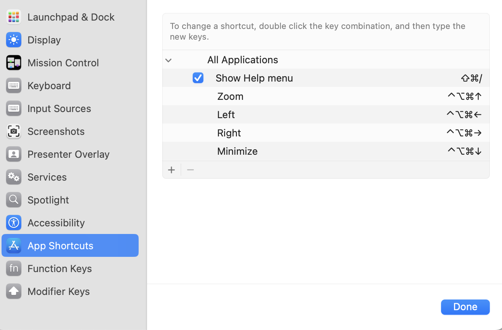
</div>

#### Option 2 – Using the Shortcuts App

1. Open the **Shortcuts** app.
2. Select **Gallery**.
3. Search for `tile` in the upper-right search bar.
4. Add the "Tile Last 2 Windows" shortcut.  
   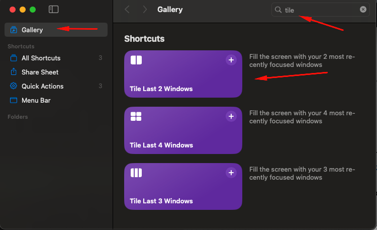
5. Edit the shortcut and rename it to `Tile Left`.  
   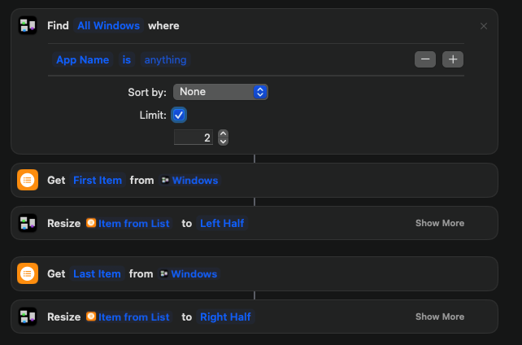
6. Remove the "Last 2" action and change the limit from 2 to 1.  
   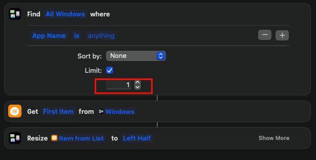
7. Duplicate the shortcut and create versions for `Tile Right` and `Fit Screen`.
8. Move the new shortcuts into the **Quick Actions** section in the left pane.
9. Open **Quick Actions** and edit each shortcut.
10. Set shortcut keys:  
    Left __`⌃ ⌥ ⌘ ←`__  
    Right __`⌃ ⌥ ⌘ →`__  
    Fit __`⌃ ⌥ ⌘ ↑`__

    Note: On a Magic Keyboard the combination may appear as __`⌃ ⌥ ⌘ 🌐︎ ↑`__. That is expected—the function key maps to the Globe key.

    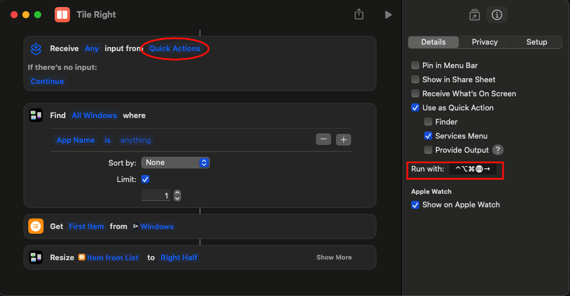

### macOS 14.x (Legacy)

The following approach works on macOS 14.x but not on 15.x.  
URL: <https://medium.com/@mohsen-vaziri/mac-keyboard-shortcuts-for-moving-app-windows-bdff89e2d163>

1. Open **System Preferences** > **Keyboard** > **Shortcuts**.
2. Select **App Shortcuts** in the left pane.
3. Click the **+** button to create a new shortcut.

Recommended shortcuts:

| Action | Shortcut |
|--------|----------|
| Zoom | __`⌃⌥⌘↑`__ |
| Move Window to Left Side of Screen | __`⌃⌥⌘←`__ |
| Move Window to Right Side of Screen | __`⌃⌥⌘→`__ |

<div align="center">
 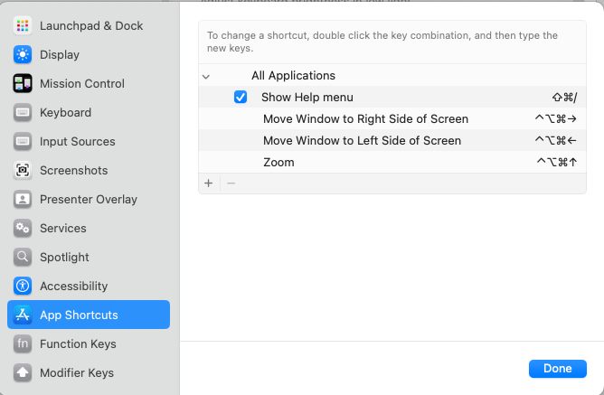
</div>

Alternatively, you can use [Amethyst](https://ianyh.com/amethyst/), a tiling window manager for macOS ![Mac OS X][macosx].  
__Note:__ I have not tested it yet.

-------------------------------------------------------------------------------

## Maccy

Maccy is a lightweight, open-source clipboard manager for macOS that keeps your copy history readily available.  
URL: <https://maccy.app/>

For the latest release, download it from GitHub: <https://github.com/p0deje/Maccy/releases>

- Set the "Open Maccy" shortcut to __`⌘§`__.
- Under Appearance, change the icon if desired.

<table border="0">
  <tr>
    <td>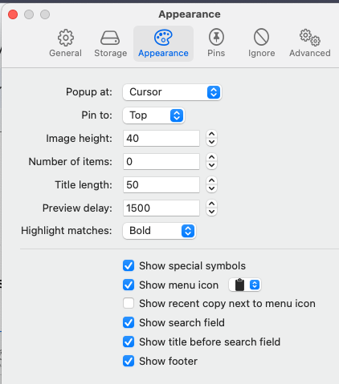</td>
    <td>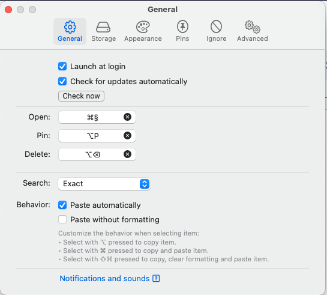</td>
  </tr>
</table>

-------------------------------------------------------------------------------

## Fonts

### Hack Nerd Font

Nerd Fonts patches developer-focused fonts with a large collection of glyphs and icons.  
URL: <https://www.nerdfonts.com/>

Download: <https://github.com/ryanoasis/nerd-fonts/releases>

Hack font download: <https://github.com/ryanoasis/nerd-fonts/releases/download/v3.4.0/Hack.zip>

Extract the ZIP archive and install the fonts.

### Meslo Font

Meslo LG is a customized version of Apple’s Menlo-Regular font (itself a customized Bitstream Vera Sans Mono).  
URL: <https://github.com/andreberg/Meslo-Font>

Extract the ZIP archive and install the fonts. The `DZ` release uses a dotted zero, while the standard version uses a slashed zero.

-------------------------------------------------------------------------------

## iTerm2

iTerm2 is a modern replacement for the default Terminal app. It runs on macOS 10.14 or newer and adds features you did not know you needed.  
URL: <https://iterm2.com/downloads.html>

- Set right-click to paste from selection.

<div align="center">
 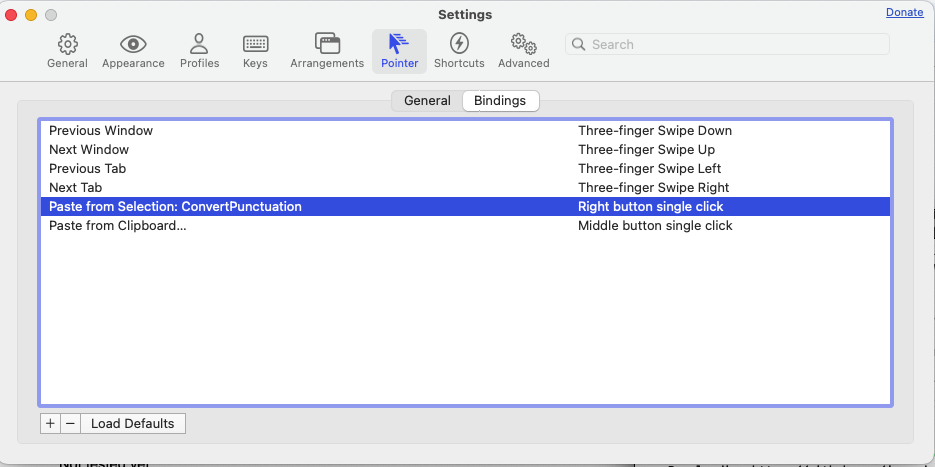
</div>

- Profiles: update the title (Job – PWD) and choose an icon.

<div align="center">
 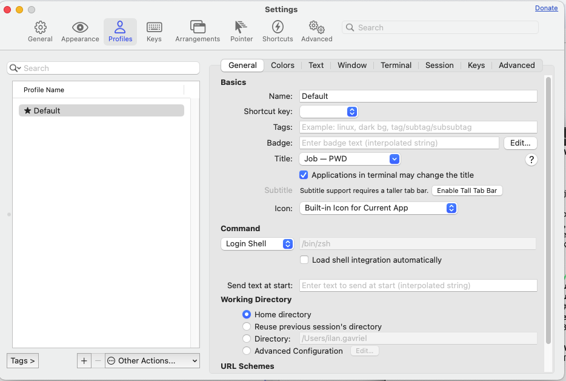
</div>

- Profiles > Text: choose `Hack Nerd Font Mono` or `MesloLGS NF`.
- Enable ligatures (ignore the warnings).

<div align="center">
 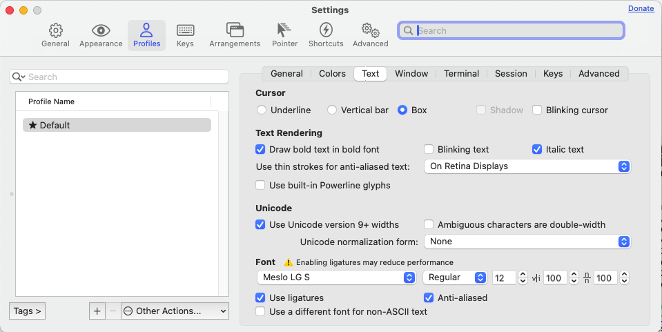
</div>

-------------------------------------------------------------------------------

## Chrome Extensions

To export your Chrome extensions, run the following script in the developer console:

1. Navigate to `chrome://extensions`.
2. Open Developer Tools (`control+shift+I` or `F12`).
3. In the console, paste the command below. If paste is blocked, type `allow paste` first.

```javascript
document.querySelector('extensions-manager').extensions_.map(({id, name, state, webStoreUrl}) => ({id, name, state, webStoreUrl}))
```

### Favorite Extensions

| Extension | Description |
|-----------|-------------|
| [Adblock for YouTube](https://chromewebstore.google.com/detail/cmedhionkhpnakcndndgjdbohmhepckk) | Removes ads from YouTube. |
| [Dark Reader](https://chromewebstore.google.com/detail/eimadpbcbfnmbkopoojfekhnkhdbieeh) | Applies dark mode to every website and reduces eye strain. |
| [Jenkins Butler](https://chromewebstore.google.com/detail/iacnkmnaiiokeinfjihcpnklijcbbcbj) | Displays Jenkins build statuses directly in Chrome. |
| [JIRA ShortCut](https://chromewebstore.google.com/detail/kjofpimpbjninggehnclcgkgniacejha) | Copies the current Jira issue as `CMD-999: Description`. |
| [OneTab](https://chromewebstore.google.com/detail/chphlpgkkbolifaimnlloiipkdnihall) | Converts all open tabs into a single list with one click. |
| [TabPilot](https://chromewebstore.google.com/detail/ghbdjeckopemkoomopmpgjifafpcjhga) | Saves and manages tab groups. |

-------------------------------------------------------------------------------

## Applications

| Application | Description |
|-------------|-------------|
| [Google Drive](https://www.google.com/drive/download/) | File synchronization and backup client. |
| [Double Commander](https://sourceforge.net/p/doublecmd/wiki/Download/) | Cross-platform twin-panel file manager inspired by Total Commander. |
| [Lightshot](https://app.prntscr.com/en/download.html) | Quick screenshot utility. Download from the App Store; change region if it is unavailable in IL. |
| [Ferdium](https://ferdium.org/download) | Aggregates multiple services in one app and supports multiple accounts per service. |
| [Joplin](https://joplinapp.org/download/) | Open-source note-taking app with secure sync across devices. |
| [Kate](https://kate-editor.org/get-it/) | Feature-rich text editor for viewing and editing plain text files. |
| [Meld](https://yousseb.github.io/meld/) | File and folder comparison utility for macOS. |
| [MX Power Gadget](https://www.seense.com/menubarstats/mxpg/) | Apple Silicon power monitoring tool. |
| [UTM](https://mac.getutm.app/) | Run virtual machines securely on your Mac. |

### AI Tools

| Application | Description |
|-------------|-------------|
| [lmstudio](https://lmstudio.ai/) | Run local AI models—GPT-OSS, Qwen, Gemma, DeepSeek, and more—privately on your computer. |
| [ollama](https://ollama.com/) | Chat with and deploy open-source models locally. |

<!-- ------------------------------------------------------------------------------- -->
<!-- This section should be at the end of the file -->
<!-- Definitions -->
[macosx]: https://img.icons8.com/color/24/mac-logo.png 'Mac OS X'
[linux]: https://img.icons8.com/color/24//linux--v1.png 'Linux'
