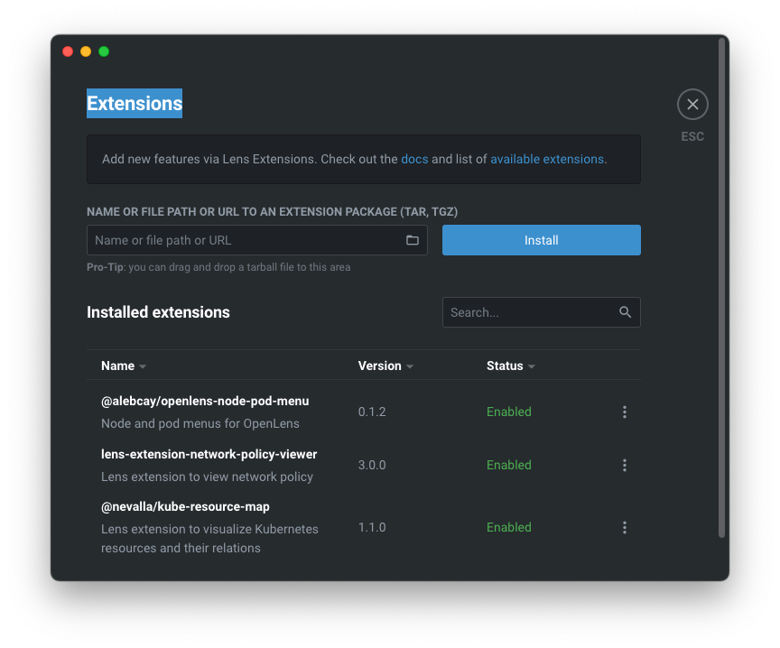

# Installing new Mac

This procedure describe how to install a new Mac laptop and configure it for python development. There also hints for the same command in Linux shell.

## Contents
- [CLI Tools](#cli-tools)
  - [Brew](#brew)
  - [oh-my-zsh](#oh-my-zsh)
    - [plugins](#plugins)
    - [Powerlevel10k](#powerlevel10k)
  - [Other CLI tools](#other-cli-tools)
  - [Bash alias](#bash-alias)
- [Editors](#editors)
  - [Installing GNU Nano](#installing-gnu-nano)
  - [Vim colors](#vim-colors)
  - [Kate](#kate)
- [Docker, Kubernates and other Vegetables](#docker-kubernates-and-other-vegetables)
  - [lazydocker](#lazydocker)
  - [K8s CLI tools](#k8s-cli-tools)
  - [K9s](#k9s)
  - [Docker Desktop](#docker-desktop)
  - [OpenLens](#openlens)
  - [Useful Commands](#useful-commands)
- [Tile windows shortcut](#tile-windows-shortcut)
- [Maccy](#maccy)
- [Meslo-Font](#meslo-font)
- [iTerm2](#iterm2)
- [Application](#applications)

-------------------------------------------------------------------------------

## CLI Tools

### Brew

URL: <https://brew.sh/>

Paste that in a macOS Terminal or Linux shell prompt

```bash
/bin/bash -c "$(curl -fsSL https://raw.githubusercontent.com/Homebrew/install/HEAD/install.sh)"
```

### oh-my-zsh

URL: <https://ohmyz.sh/#install>

Paste that in a macOS Terminal or Linux shell prompt

```bash
sh -c "$(curl -fsSL https://raw.githubusercontent.com/ohmyzsh/ohmyzsh/master/tools/install.sh)"
```

#### plugins

URL: [Oh my ZSH with zsh-autosuggestions zsh-syntax-highlighting zsh-fast-syntax-highlighting and zsh-autocomplete.md](https://gist.github.com/n1snt/454b879b8f0b7995740ae04c5fb5b7df)

Install zsh plugins from brew

Mac OS ![Mac OS X][macosx]

```bash
# Install tools
brew install zsh-autosuggestions zsh-syntax-highlighting
```

Ubuntu/debian ![Linux][linux]

```bash
sudo apt install zsh-autosuggestions zsh-syntax-highlighting
```

install plugins in zsh:

```bash
# Install plugins
## zsh-autosuggestions plugin
git clone --depth 1  https://github.com/zsh-users/zsh-autosuggestions.git $ZSH_CUSTOM/plugins/zsh-autosuggestions

## zsh-syntax-highlighting plugin
git clone --depth 1  https://github.com/zsh-users/zsh-syntax-highlighting.git $ZSH_CUSTOM/plugins/zsh-syntax-highlighting

## zsh-fast-syntax-highlighting plugin
git clone --depth 1 https://github.com/zdharma-continuum/fast-syntax-highlighting.git $ZSH_CUSTOM/plugins/fast-syntax-highlighting

## zsh-autocomplete plugin
git clone --depth 1 https://github.com/marlonrichert/zsh-autocomplete.git $ZSH_CUSTOM/plugins/zsh-autocomplete
```

Enable plugins by adding them to .zshrc

```bash
vi ~/.zshrc
```

Find the line which says plugins=(git) and replace that line with

```bash
# this line is used for zsh plugins only
plugins=(git zsh-autosuggestions zsh-syntax-highlighting fast-syntax-highlighting zsh-autocomplete)

# use this line for python, docker, k8s, npm and zsh plugins
plugins=(git brew colored-man-pages colorize python pip pyenv docker kubectl helm azure npm nvm vault zsh-interactive-cd zsh-autosuggestions zsh-syntax-highlighting zsh-autocomplete)
```

run .zshrc

```bash
source ~/.zshrc
```

#### Powerlevel10k

URL: <https://github.com/romkatv/powerlevel10k?tab=readme-ov-file#oh-my-zsh>
Clone the repository:

```bash
git clone --depth=1 https://github.com/romkatv/powerlevel10k.git $ZSH_CUSTOM/themes/powerlevel10k

# Enable theme by adding them to .zshrc
vi ~/.zshrc
```

Find the line which says ZSH_THEME= and replace that line with

```bash
set ZSH_THEME="powerlevel10k/powerlevel10k"
```

Run configuration again

```bash
p10k configure
```

### Other CLI tools

|__Tool__| Description |
|-|-|
|__mc__| Midnight commander |
|__vifm__| vi file manager |
|__tmux__| Terminal multiplexer |
|__ranger__| Visual file manager |
|__highlight__| A universal source code to formatted text converter - good for ranger |
|__multitail__| Browse through several files at once |
|__colortail__| Log colorizer that makes log checking easier|
|__ccze__| A fast log colorizer written in C |
|__htop__| Interactive process viewer |
|__nmon__| Benchmark tool |
|__bat__| batcat - source code formatted cat replacement |
|__fzf__| A command-line fuzzy finder - interactive find |
|__ripgrep__| rg - recursively search the current directory for lines matching a pattern |
|__tldr__| Simplified and community-driven man pages - man replacement |
|__exa__| A modern replacement for ls (ubuntu/debian, not on mac) ![Linux][linux] |
|__lsd__| The next generation `ls` command, written in Rust. (mac) ![Mac OS X][macosx] |
|__ncdu__| NCurses Disk Usage |
|__duf__| Disk Usage/Free Utility |
|__neofetch__| Display information about your operating system, software and hardware |
|__tig__| A text-mode interface for Git |

- Best ncurses linux console programs <https://www.etcwiki.org/wiki/Best_ncurses_linux_console_programs>
- Command line tools <https://hackingcpp.com/dev/command_line_tools.html>

Installing commands

Mac OS ![Mac OS X][macosx]

```bash
brew install mc vifm tmux ranger highlight
brew install multitail colortail ccze htop
brew install bat fzf ripgrep tldr lsd
brew install ncdu duf neofetch tig
```

Ubuntu/debian ![Linux][linux]

```bash
sudo apt install mc vifm tmux ranger highlight
sudo apt install multitail colortail ccze htop
sudo apt install bat fzf ripgrep tldr lsd
sudo apt install ncdu duf neofetch tig
```

### Bash alias

Create a bash aliases file using echo command

```bash
touch ~/.bash_aliases
echo -e \
"export HISTCONTROL=ignoreboth:erasedups\n"\
"alias h='history'\n"\
"alias which='type -a'\n"\
"alias ..='cd ..'\n"\
"alias ls='/bin/ls -h --color=auto'\n"\
"alias ll='ls -lv --group-directories-first'\n"\
"alias lt='ls -ltr'         #  Sort by date, most recent last\n"\
"alias lm='ll | more'       #  Pipe through more\n"\
"alias lr='ll -R'           #  Recursive ls\n"\
"alias la='ll -a'           #  Show hidden files\n"\
"alias grep='/bin/grep --color=auto'\n"\
"alias diff='/usr/bin/diff --color=auto'\n"\
"alias bat=batcat\n"\
"alias dex='_dexec(){ docker exec -it \"\$@\" bash; unset -f _dexec;}; _dexec'\n"\
"alias dps='docker ps --format \"table {{.Names}}\t{{.ID}}\t{{.Image}}\t{{.Ports}}\" | sort'\n"\
"alias lzw='~/.local/bin/lazydocker'   # in case you installed it\n"\
"bind '\"\\\\e[6~\": history-search-forward'\n"\
"bind '\"\\\\e[5~\": history-search-backward'\n"\
"# enable colored prompt for git branches using parse_git_branch\n"\
"function parse_git_branch() { git branch 2> /dev/null | sed -e '/^[^*]/d' -e 's/* \(.*\)/(\1)/'; }\n"\
"export PS1=\$(parse_git_branch)\$PS1\n"\
> ~/.bash_aliases
```

-------------------------------------------------------------------------------

## Editors

### Installing GNU Nano

URL: <https://gist.github.com/GLMeece/94b8dcc20b9785d5b783ba5498b52fdf#installing-gnu-nano>

Mac OS ![Mac OS X][macosx]

```bash
brew install nano
```

Ubuntu/debian ![Linux][linux]

```bash
sudo apt install nano
```

To enable Syntax Highlighting execute:

```bash
nano ~/.nanorc
```

Add this line

```bash
include "/opt/homebrew/Cellar/nano/*/share/nano/*.nanorc"
```

Type __`⌃-o`__ (control-o) and hit __`⏎`__ (enter or return) to save the file.
Type __`⌃-x`__ (control-x) to exit.

### Vim colors

URL: <https://www.cyberciti.biz/faq/turn-on-or-off-color-syntax-highlighting-in-vi-or-vim/>

How to enable vim syntax colors option
The permanent procedure is as follows for vim/vi:
Edit ~/.vimrc file by typing the command:

```bash
vi ~/.vimrc
```

Append the following option:

```bash
" Indentation
set tabstop=4      " Number of spaces that a <Tab> counts for
set shiftwidth=4   " Number of spaces for each step of (auto)indent
set expandtab      " Use spaces instead of tabs

" Search
set ignorecase     " Ignore case while searching
set smartcase      " Override ignorecase if search contains capital letters
set incsearch      " Show matches as you type
set hlsearch       " Highlight search results

" Syntax highlighting - works on vim only
syntax   on
filetype on

" Toggle paste mode with F2
" Auto-indentation, Line wrapping, Syntax highlighting adjustments, Mapping of certain keys
set pastetoggle=<F2>
```

Save and close the file

### Kate

To install Kate on macOS, follow these steps:
1. Download the Kate installer for your Mac Url: https://kate-editor.org/get-it/
2. Once downloaded, click on the .dmg file and double-click the "kate" icon or drag it to the Applications folder.
3. You may encounter a security warning stating that "kate" can't be opened because Apple cannot check it for malicious software. To override this:
   - Go to "System Preferences" > "Security & Privacy" > "General"
   - Look for a note saying "Kate" was blocked from use
   - Click "Open Anyway" and confirm in the pop-up
4. After installation, you can launch Kate from your Applications folder.

Note: For a more stable version, you can consider alternative installation methods:
- Install Kate using MacPorts by running `sudo port install kate` in the terminal (requires MacPorts to be installed) URL: https://ports.macports.org/port/kate/

-------------------------------------------------------------------------------

## Docker, Kubernates and other Vegetables

### lazydocker

Install `lazydocker` <https://github.com/jesseduffield/lazydocker#installation> MIT License.
Normally lazydocker formula can be found in the Homebrew core but we suggest you tap our formula to get a frequently updated one. It works with Linux, too.

```bash
brew install jesseduffield/lazydocker/lazydocker
```

### K8s CLI tools

Command line tool (kubectl) - Kubernetes provides a command line tool for communicating with a Kubernetes cluster's control plane, using the Kubernetes API.

```bash
brew install kubectl
```

__kubectx__ is a tool to switch between contexts (clusters) on kubectl faster.
__kubens__ is a tool to switch between Kubernetes namespaces (and configure them for kubectl) easily.

```bash
brew install kubectx
```

URL: <https://github.com/ahmetb/kubectx>

### K9s
K9s is a terminal based UI to interact with your Kubernetes clusters. The aim of this project is to make it easier to navigate, observe and manage your deployed applications in the wild. K9s continually watches Kubernetes for changes and offers subsequent commands to interact with your observed resources.

```bash
brew install derailed/k9s/k9s
```

URL: https://k9scli.io/topics/install/

### Docker Desktop

URL <https://docs.docker.com/desktop/install/mac-install/>

Activate Kubernetes in settings

<div align="center">
 
</div>

Fix docker group to user
URL: ​​https://docs.docker.com/engine/install/linux-postinstall/

```bash
sudo usermod -aG docker $USER
```

If that's not working us the following

```bash
# sudo groupadd docker   # add the group if not exist

sudo usermod -aG docker $USER
newgrp docker
docker run hello-world   # test in user mode
```

### OpenLens

Open source Kubernetes management tool (alternative for Lens IDE)
URL: https://github.com/MuhammedKalkan/OpenLens/releases

Extensions to install
Open Extensions menu, and add the following extensions

- @alebcay/openlens-node-pod-menu
- lens-extension-network-policy-viewer
- @nevalla/kube-resource-map



### Useful commands

List of all images sorted by name

```bash
docker ps --format "table {{.Names}}\t{{.ID}}\t{{.Image}}\t{{.Ports}}" | sort
```

List of all pods sorted by name

```bash
kubectl get pods -n <namespace> -o custom-columns="NAME:.metadata.name,IMAGE:.spec.containers[*].image" | sort
```

List of pods all mount path

```bash
kubectl get pods -n qa-env  -o custom-columns="POD:metadata.name,MOUNT:spec.containers[*].volumeMounts[*].mountPath"
```

-------------------------------------------------------------------------------

## Tile windows shortcut

#### Open source Rectangle application

1. go to the web site https://rectangleapp.com/
2. download the latest version and install it
3. Allow to load it on login `system > General > Login items & Extensions`

### mac OS 15.x

#### Option 1 - using system preferences

We can assign system-wide keyboard shortcuts:

1. Open __`System Preferences`__ > __`Keyboard`__ > __`Shortcuts`__
2. On the left pane select __`App Shortcuts`__.
3. Press the __`+`__ button to create a new shortcut.

Here are my shortcuts:
| Action | Shortcut |
|--------|----------|
| Zoom | __`⌃⌥⌘↑`__ |
| Left | __`⌃⌥⌘←`__ |
| Right | __`⌃⌥⌘→`__ |
| Minimize | __`⌃⌥⌘M`__ |

<div align="center">
 
</div>

#### Option 2 - using Shortcut application

1. Use `Shortcut` app to add tile shortcuts
2. Select `Gallery`
3. Search `tile` in the upper right search bar
4. Add the "Tile Last 2 Windows"
   

5. Edit the shortcut and Rename to `Tile Left`
   

6. Remove the last 2 section and change the limit from 2 to 1
   

7. Duplicate the shortcut and do the same for `Tile Right` and also for `Fit Screen`
8. Copy the new shortcuts to the `Quick Actions` section on the left bar of the application
9. Go to the `Quick Actions` section and edit the shortcuts
10. Select `Quick Actions` in the first line and set a shortcut key:
    Left __`⌃ ⌥ ⌘ →`__
    Right __`⌃ ⌥ ⌘ ←`__
    Fit __`⌃ ⌥ ⌘ ↑`__
    NOTE: if you are using a magic keyboard you may get this combination as result __`⌃ ⌥ ⌘ 🌐︎ ↑`__ this is OK - its map the function key as globe key
    

### mac OS 14.x - OBSOLETE: The following section is working in mac OS 14.x and not for 15.0

URL: https://medium.com/@mohsen-vaziri/mac-keyboard-shortcuts-for-moving-app-windows-bdff89e2d163
We can assign system-wide keyboard shortcuts to the commands mentioned above.
To do so you can do the following:
1. Open __`System Preferences`__ > __`Keyboard`__ > __`Shortcuts`__
2. On the left pane select __`App Shortcuts`__.
3. Press the __`+`__ button to create a new shortcut.

Here are my shortcuts:
| Action | Shortcut |
|--------|----------|
| Zoom | __`⌃⌥⌘↑`__ |
| Move Window to Left Side of Screen | __`⌃⌥⌘←`__ |
| Move Window to Right Side of Screen | __`⌃⌥⌘→`__ |

<div align="center">
 
</div>

Alternatively you can use  Amethyst - A tiling window manager for Mac OS ![Mac OS X][macosx] 
__Note:__ I didn’t  tested yet
URL: https://ianyh.com/amethyst/

-------------------------------------------------------------------------------

## Maccy

Clipboard manager for macOS which does one job - keep your copy history at hand. Period.
Lightweight. Open source. No fluff.
URL: https://maccy.app/

Better download from git and install from there
URL: https://github.com/p0deje/Maccy/releases

Change Open shortcut to __`⌘§`__
Appearance - Change icon

<table border="0">
  <tr>
    <td></td>
    <td></td>
  </tr>
</table>

-------------------------------------------------------------------------------

## Fonts:

### Hack Nerd Font

Nerd Fonts patches developer targeted fonts with a high number of glyphs (icons).
URL: https://www.nerdfonts.com/

Download: https://github.com/ryanoasis/nerd-fonts/releases

Hack Font URL: https://github.com/ryanoasis/nerd-fonts/releases/download/v3.4.0/Hack.zip

Extract the zip and install fonts

### Meslo-Font

Meslo LG is a customized version of Apple’s Menlo-Regular font (which is a customized Bitstream Vera Sans Mono).
URL: https://github.com/andreberg/Meslo-Font
Extract the zip and install fonts DZ is dotted zero, while the regular is slashed zero

-------------------------------------------------------------------------------

## iTerm2

iTerm2 is a replacement for Terminal and the successor to iTerm. It works on Macs with macOS 10.14 or newer. iTerm2 brings the terminal into the modern age with features you never knew you always wanted.
https://iterm2.com/downloads.html

Setting modify right click to paste from selection

<div align="center">
 
</div>

Profiles: Change title - Job - PWD
Change icon

<div align="center">
 
</div>

Profiles Text - Choose `Hack Nerd Font Mono` or `MesloLGS NF`
Select use ligatures (ignore the warnings)

<div align="center">
 
</div>

-------------------------------------------------------------------------------

## Chrome Extension

To export your extensions from chrome use the following script in the chrome debugger console.

1. Go to the following chrome page ```chrome://extensions```
2. Open the developer tools ```control+shift+I``` or ```F12```
3. In the console paste the following command (In case its blocking write ```allow paste```)

```javascript
document.querySelector('extensions-manager').extensions_.map(({id, name, state, webStoreUrl}) => ({id, name, state, webStoreUrl}))
```

### My Favorite Extensions

| Extension | Description |
|-----------|-------------|
| [Adblock for Youtube](https://chromewebstore.google.com/detail/cmedhionkhpnakcndndgjdbohmhepckk) | Removes ads from Youtube |
| [Dark Reader](https://chromewebstore.google.com/detail/eimadpbcbfnmbkopoojfekhnkhdbieeh) | Dark mode for every website. Take care of your eyes, use dark theme for night and daily browsing. |
| [Jenkins Butler](https://chromewebstore.google.com/detail/iacnkmnaiiokeinfjihcpnklijcbbcbj) | Feature rich Chrome Extension to show status of Jenkins builds directly on your desktop. |
| [JIRA ShortCut](https://chromewebstore.google.com/detail/kjofpimpbjninggehnclcgkgniacejha) | Copy to clip board jira issue as 'CMD-999: Description' |
| [OneTab](https://chromewebstore.google.com/detail/chphlpgkkbolifaimnlloiipkdnihall) | click the OneTab icon to convert all of your tabs into a list |
| [TabPilot](https://chromewebstore.google.com/detail/ghbdjeckopemkoomopmpgjifafpcjhga) | Save and Manage Tab Groups |


-------------------------------------------------------------------------------

## Applications

| Application | Description |
|-------------|-------------|
| [Google Drive](https://www.google.com/drive/download/) |  |
| [Double Commander](https://sourceforge.net/p/doublecmd/wiki/Download/) | Double Commander is a cross platform open source file manager with two panels side by side. It is inspired by Total Commander and features some new ideas. |
| [Lightshot](https://app.prntscr.com/en/download.html) | The fastest way to take a customizable screenshot. Download using the appstore. this app is not located in IL region - you may need to change your region to download it. |
| [Fredium](https://ferdium.org/download) | Add all your services in one place for quick and easy access and never search your tabs or bookmarks again! You can also add the same service twice or more to be able to login into multiple accounts! |
| [Joplin](https://joplinapp.org/download/) | Joplin is an open source note-taking app. Capture your thoughts and securely access them from any device. |
| [Kate](https://kate-editor.org/get-it/) | Kate is packed with features that will make it easier for you to view and edit all your text files |
| [Meld](https://yousseb.github.io/meld/) | File and folder comparison made easy for Mac/OSX |
| [MX Power Gadget](https://www.seense.com/menubarstats/mxpg/) | Apple Silicon Power Gadget |
| [UTM](https://mac.getutm.app/) | Securely run operating systems on your Mac |

AI Tools
| Application | Description |
|-------------|-------------|
| [lmstudio](https://lmstudio.ai/) | Local AI, on Your Computer. Run local AI models like gpt-oss, Qwen, Gemma, DeepSeek and many more on your computer, privately and for free. |
| [ollama](https://ollama.com/) | Chat & build with open models |


<!-- ------------------------------------------------------------------------------- -->
<!-- This section should be in the end of the file -->
<!--Definitions-->
[macosx]: https://img.icons8.com/color/24/mac-logo.png 'Mac OS X'
[linux]: https://img.icons8.com/color/24//linux--v1.png 'Linux'
